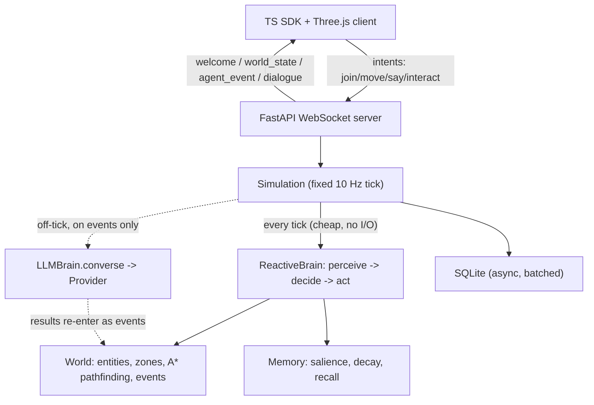

# SYNK

Open-source framework for intelligent, LLM-driven NPCs in web-based 3D worlds. A server-authoritative Python runtime drives agent behavior, memory, and dialogue; a TypeScript SDK plus a Three.js demo render the world so a player can walk up, talk, and interact in real time.

The headline idea is the **hybrid brain**: a cheap reactive layer runs every tick with no network I/O, and the expensive LLM layer fires only on meaningful events. An idle world costs near zero; adding an API key upgrades NPC dialogue to real LLM reasoning.

> Status: under construction. See `fix_plan.md` for the build plan and `PROGRESS.md` for the journal.

## Quickstart

No API key required — the server runs the **MockProvider + reactive brain**, so NPCs
move, navigate, and talk out of the box. (Adding a key upgrades dialogue to a real LLM;
see [Upgrading](#upgrading-to-real-llm-dialogue).)

**Prerequisites:** Python 3.11+ and Node 18+.

**1. Backend** (serves the tavern world on `:8000`):

```bash
cd server
python3 -m venv .venv && source .venv/bin/activate
pip install -e .
uvicorn synk.server:app --port 8000
```

**2. Client** (Three.js demo, in a second terminal):

```bash
cd client
npm install
npm run dev
```

**3. Play:** open the URL Vite prints (default <http://localhost:5173>). Use **WASD**
to move, walk up to an NPC named Gus, Mira, or Tomas, and type in the chat box to talk.
The panel on the right shows the focused agent's live action and recent activity.

Sanity-check the runtime with no browser at all:

```bash
cd server && python examples/tavern.py --selftest   # 3 NPCs, 80 ticks
cd server && python examples/headless_demo.py --selftest
```

## Architecture

The server is authoritative: clients send intents and render snapshots; all agent
state lives server-side.



Layers: **World** (entities, zones, xz spatial queries, tick clock, event buffer),
**Perception** (sense-radius, zone-scoped percepts), **Pathfinding** (grid A* around
obstacles), **Memory** (salience + decay + recall), **Brain** (reactive `decide` +
deliberative `converse`), **Simulation** (the loop), **Server** (the protocol).

## The hybrid brain

The whole point of SYNK is that intelligence is **two layers**:

- **Reactive layer** — runs *every tick*, synchronously, with zero network I/O.
  Wander, steer toward targets, pathfind around obstacles, face entities, emote.
  This drives continuous behavior for free.
- **Deliberative (LLM) layer** — fires *only on meaningful events*: a player speaks to
  the agent, a salient event crosses a threshold, or a low-frequency reflection timer.
  It runs **off the tick** as an async task; its result is injected back into the world
  as events on a later tick.

The hard invariant: **the LLM is never called on the per-tick path and never awaited on
the tick** (enforced by a test). So an idle world with 100 NPCs costs essentially zero —
you only spend tokens when something worth thinking about happens.

## Upgrading to real LLM dialogue

By default `SYNK_PROVIDER` is unset and no keys are present, so the **MockProvider**
serves deterministic, offline lines. To use a real model, install the extra and set a key:

```bash
pip install -e ".[llm]"          # installs anthropic + openai SDKs
export ANTHROPIC_API_KEY=sk-...  # or: export OPENAI_API_KEY=sk-...
uvicorn synk.server:app --port 8000
```

Provider selection (`synk.brains.providers.select_provider`): explicit `SYNK_PROVIDER`
(`mock`/`anthropic`/`openai`) wins; otherwise a present key auto-selects; otherwise Mock.
NPC dialogue then comes from the LLM, with structured actions (move_to, give_item, emote,
set_goal, handoff) parsed from its output — malformed output safely degrades to speech.

## Documentation

- _TODO (task 118): writing a custom brain._
- _TODO (task 118): adding a custom structured action._

## License

MIT — see [LICENSE](LICENSE).
