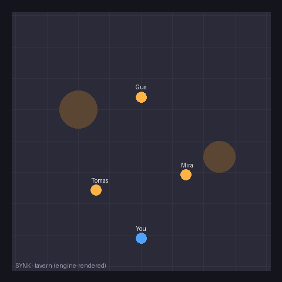
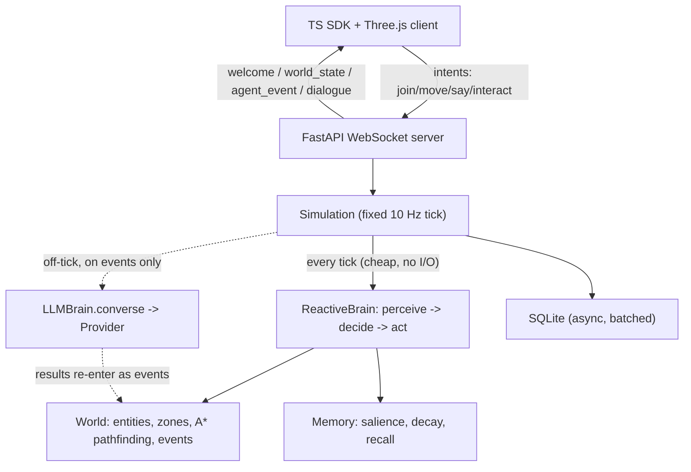

# SYNK

[](LICENSE)


> Repository: [`AgamV01/SYNK-`](https://github.com/AgamV01/SYNK-) (the project is **SYNK**; the
> GitHub repo name carries a trailing dash, so `git clone` creates a `SYNK-` directory).

Open-source framework for intelligent, LLM-driven NPCs in web-based 3D worlds. A server-authoritative Python runtime drives agent behavior, memory, and dialogue; a TypeScript SDK plus a Three.js demo render the world so a player can walk up, talk, and interact in real time.



> 🎥 Engine-rendered isometric view of the tavern: the player (blue) walks up to Gus, the
> NPCs react and converge, and Gus greets back in a speech bubble — all driven by the real
> `Simulation` + reactive brains. Regenerate with `python tools/render_demo_gif.py`.
> _(Swap in a screen capture of the 3D Three.js client for the full effect.)_

The headline idea is the **hybrid brain**: a cheap reactive layer runs every tick with no network I/O, and the expensive LLM layer fires only on meaningful events. An idle world costs near zero; adding an API key upgrades NPC dialogue to real LLM reasoning.

## Features

- **Hybrid brain** — reactive behavior every tick (zero I/O); the LLM fires only on meaningful events, off the tick (enforced by a test).
- **Runs with zero API keys** — MockProvider + reactive dialogue out of the box; drop in Anthropic or OpenAI to upgrade.
- **Server-authoritative** — clients send intents and render snapshots; all agent state lives on the server.
- **Real navigation** — grid-based A\* pathfinding around obstacles, not naive straight-line steering.
- **Memory** — salience-weighted items with decay and recall (recent ∪ salient), plus low-frequency reflection.
- **Pluggable** — swap the LLM provider or the whole brain behind small interfaces.
- **Persistence** — async, batched SQLite; world + memories survive restarts and never block the tick.
- **TypeScript SDK + Three.js demo** — typed WebSocket client with auto-reconnect, and a playable tavern with 3 NPCs.

## Quickstart

No API key required — the server runs the **MockProvider + reactive brain**, so NPCs
move, navigate, and talk out of the box. (Adding a key upgrades dialogue to a real LLM;
see [Upgrading](#upgrading-to-real-llm-dialogue).)

**Prerequisites:** Python 3.11+ and Node 18+.

**0. Clone:**

```bash
git clone https://github.com/AgamV01/SYNK-.git
cd SYNK-
```

**1. Backend** (serves the tavern world on `:8000`):

```bash
cd server
python3 -m venv .venv && source .venv/bin/activate
pip install -e .
uvicorn synk.server:app --port 8000
```

**2. Client** (Three.js demo, in a second terminal):

```bash
cd client
npm install
npm run dev
```

**3. Play:** open the URL Vite prints (default <http://localhost:5173>). Use **WASD**
to move, walk up to an NPC named Gus, Mira, or Tomas, and type in the chat box to talk.
The panel on the right shows the focused agent's live action and recent activity.

Sanity-check the runtime with no browser at all:

```bash
cd server && python examples/tavern.py --selftest   # 3 NPCs, 80 ticks
cd server && python examples/headless_demo.py --selftest
```

### Or run everything with Docker

```bash
docker compose up --build
```

Server on <http://localhost:8000>, demo client on <http://localhost:8080>. The world and
NPC memories persist to a named volume, so they survive restarts.

## Architecture

The server is authoritative: clients send intents and render snapshots; all agent
state lives server-side.



Layers: **World** (entities, zones, xz spatial queries, tick clock, event buffer),
**Perception** (sense-radius, zone-scoped percepts), **Pathfinding** (grid A* around
obstacles), **Memory** (salience + decay + recall), **Brain** (reactive `decide` +
deliberative `converse`), **Simulation** (the loop), **Server** (the protocol).

## The hybrid brain

The whole point of SYNK is that intelligence is **two layers**:

- **Reactive layer** — runs *every tick*, synchronously, with zero network I/O.
  Wander, steer toward targets, pathfind around obstacles, face entities, and emote.
  This drives continuous behaviour for free.
- **Deliberative (LLM) layer** — fires *only on meaningful events*: a player speaks to
  The agent, a salient event crosses a threshold, or a low-frequency reflection timer.
  It runs **off the tick** as an async task; its result is injected back into the world
  as events on a later tick.

The hard invariant: **the LLM is never called on the per-tick path and never awaited on
the tick** (enforced by a test). So an idle world with 100 NPCs costs essentially zero —
you only spend tokens when something worth thinking about happens.

## Upgrading to real LLM dialogue

By default, `SYNK_PROVIDER` is unset and no keys are present, so the **MockProvider**
serves deterministic, offline lines. To use a real model, install the extra and set a key:

```bash
pip install -e ".[llm]"          # installs anthropic + openai SDKs
export ANTHROPIC_API_KEY=sk-...  # or: export OPENAI_API_KEY=sk-...
uvicorn synk.server:app --port 8000
```

Provider selection (`synk.brains.providers.select_provider`): explicit `SYNK_PROVIDER`
(`mock`/`anthropic`/`openai`) wins; otherwise a present key auto-selects; otherwise Mock.
NPC dialogue then comes from the LLM, with structured actions (move_to, give_item, emote,
set_goal, handoff) parsed from its output — malformed output safely degrades to speech.

## Documentation

- [Writing a custom brain](docs/writing-a-brain.md)
- [Adding a custom structured action](docs/custom-actions.md)

## How this was built

SYNK's v1 core was built **autonomously by Claude Code** with a *Ralph Wiggum loop* — the
same short prompt re-fed to a fresh context each iteration, with all state living in files
and git history rather than the model's memory. The build landed as **120 small,
individually verified commits**: every task ended in one machine-checkable `verify:` command
(a passing test, a clean type-check, a green build) and was marked done only once that
command actually passed — holding an **≥80% coverage gate** the whole way (~94% final). The
harness that drove it lives in the repo: `PROMPT.md`, `specs/`, `fix_plan.md`, `PROGRESS.md`.

A later release-readiness pass hardened security, wired up the memory/persistence/overhearing
layers, added proactive + NPC↔NPC deliberation, a spatial index, and CI/Docker/packaging —
bringing the repo to **149 commits, 209 tests, 94% coverage**. See [`REVIEW.md`](REVIEW.md).

## License

MIT — see [LICENSE](LICENSE).
